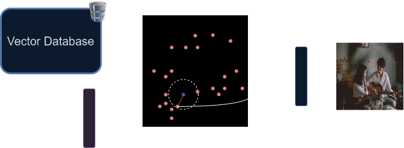
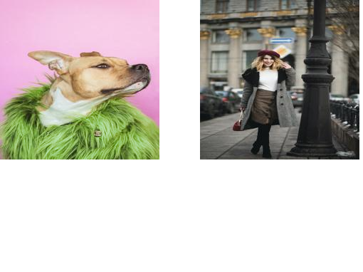

#AI #deeplearning #ml #dl #neuralnetorks #embeddings #creativity


---

## Demo

<video width="600" controls>
  <source src="./assets/video.mp4" type="video/mp4">
  Your browser does not support the video tag.
</video>

---

## TLDR

Creativec uses a linear combination of embedding vectors to produce a query vector and uses it as a search parameter in a vector database to search for content that possesses shared features with the initial embedding vectors' respective contents. The idea is that by linearly combining two or more embedding vectors, we generate another vector that shares features. For example, if the embedding vector of an image of a dog is added to the embedding vector of an image of a child running, the resulting vector will be closest to vectors of images of dogs running or boys running with their dogs. This is the process of creativity—merging two different concepts to give birth to a third one.

The description of how the app works is simple: we select a dataset, and for each data point, we generate a respective embedding vector and store both the data and the vector in a vector database. The application displays a set of data, and by selecting some of them, the system retrieves their respective embedding vectors, generates a linear combination between them, and uses the vector as a query parameter to search for other vectors and their content that are closest to this query vector, finally displaying the closest results' content to the user.

---

# Installation

`Note:` **Installation via docker-sompose will be available soon.**

To install and run Creativec, follow these steps:

1. Clone the repository:

   ```bash
   git clone https://github.com/GuilhermeToso/creativec.git
   ```

2. Navigate to the `server` directory and create a virtual environment:

   ```bash
   cd server
   python -m venv venv
   ```

3. Install the required dependencies:

   ```bash
   source venv/bin/activate   # For Linux/Mac
   .\venv\Scripts\activate     # For Windows
   pip install -r requirements.txt
   ```

4. Start the API:

   ```bash
   cd src/api
   uvicorn main:app --reload
   ```

5. Open a new shell, navigate to the `client` directory, install dependencies, and run the development server:
   ```bash
   cd client
   npm install
   npm run dev
   ```

---

## Technologies Used

- **Backend**: FastAPI (Python), Uvicorn
- **Frontend**: React (Next.js)
- **Vector Database**: ChromaDB
- **Embedding Generation**: Transformer-based neural networks
- **Containerization**: Docker (optional)

---

# 1 - Introduction

**Creativec** is an attempt to provide creativity ability for intelligent systems through mathematical operations between embedding vectors. Creativity is the ability to produce a novel idea, which can, in turn, become a real entity in the physical world. However, the process of this production is still a mystery, so here we will dive into the world of hypotheses.

The process that produces a novel idea will start from the principle that _a novel idea possesses a semantic that is constituted of at least two semantics from other ideas._ Essentially, the novel idea contains elements that are present in different ideas. For example, it's Sunday, and you are still excited about the rock show you went to last night and happy about the pasta with cheese you ate on Friday, so you think, "_I might cook a hamburger while I listen to some heavy metal._" You do it, post it on social media, and suddenly it's a trend. People are now cooking while they sing or play an instrument, making a cooking show with an epic soundtrack. It becomes viral and fun, and after a while, somebody will ask themselves: _Who was that creative?_

But are there any artificial intelligence algorithms capable of doing so? Imagine a system capable of mixing chemical information to generate a new substance, a new protein for a new treatment or drug. Imagine a mixture of an art style and a picture—you could see things never generated by humans before. Imagine a sequence of ideas that directs an AI system to a desired sequence of outputs, like a chain of thoughts that resembles a form of cognition.

In 2014, I had a glimpse that this might be possible when Mikolov et al. (2013) found that semantic patterns could be discovered using vector arithmetic. For example, the representation "Man is to Woman what Brother is to Sister" could be generated by the following operations between word vectors: "Brother" - "Man" + "Woman." This generates a vector closer to the word "Sister." It's like the word "Sister" is composed by the presence of the elements "Brother" and "Woman" and the absence of the word "Man." When I saw this, I imagined that creativity was near, but semantics at the word level wasn't enough. Then the transformer architecture came out, and the possibility to encapsulate an entire text's semantics was a huge step toward ideas' mixture.

Creativec uses transformer-based architecture neural networks to generate semantic vectors, or embedding vectors, that represent the input data's semantics. Then, in the next step, we arithmetically operate over the batch of embedding vectors to produce one vector only, which is then used to find vectors that are closest to it and return the inputs that generate those similar vectors. In the following sections, I will present the math behind this, the methodology used in the application, some results, and a conclusion.

---

# 2 - Mathematics

Suppose there exists an embedding vector space $\mathbb{V}$ over the field of $\mathbb{R}$. Each vector $\mathbf{v} \in \mathbb{V}$ is a low-dimensional numeric representation of the semantics of a corresponding data point $\mathbf{x}$. Therefore, the existence of a set of data $X$ guarantees the existence of a corresponding set of embeddings $V \subset \mathbb{V}$.

Suppose that our set $X$ can be organized as a union of topic subsets $X_{t}$ for all topics $t$ in the set of topics $T$. Hence:

$$X = \bigcup_{t=0}^{T}X_{t}$$
A topic $t$ is a certain domain in which each element $\mathbf{x} \in X_{t}$ shares the same semantics. For example, this subset can be all images related to puppies; hence, the topic is a puppy. The topic is highly correlated with a subset of $\mathbf{x}$ such that they have a small deviation around the token distributions that constitute a piece of information $\mathbf{x}$. For example, an image pixel can be said to be a token, the minimal piece of information to represent our data $\mathbf{x}$ (the image). So, if we consider how the tokens, or pixels, are distributed over the image and over all images of puppies, we will find some patterns, like edges, shapes, colors, etc. These patterns are token distributions with high probabilities. Consequently, a topic for boats will produce a different token distribution.

Given our set of subsets per topic $t$, we will also represent the set of embeddings as a union of topic subsets of embeddings $V_{t}$. Therefore:

$$V = \bigcup_{t=0}^{T}V_{t}$$

The correspondence is valid due to the ability of a neural network to learn an output space depending on the model task. We will use contrastive learning models, which essentially aim to approximate the embedding vectors of similar content (e.g., two images of a dog, or two sentences about dogs, or even a pair of an image and text about dogs) and separate the embeddings of non-similar content (e.g., a dog image and a boat image). Hence, the _desired output space_ consists of multiple sets, each containing similar embedding vectors corresponding to a set of similar content in $X$. With this proof and objective, we guarantee the existence of $T$ sets in the vector space $\mathbb{V}$, just as there are $T$ sets in the data space $\mathbb{X}$.

Let's define a span subspace $U_{t}$, which represents all linear combinations between the vectors that compose the set $V_{t}$. Hence:
$$v_{res} = \sum_{v_{i}\in V_{t}}a_{i}v_{i} \implies U_{t} = span(V_{t})$$
The subspace spanned by any two topic subsets $V_{i} \cup V_{j}$ is the following:

$$U = span(V_{i} \cup V_{j}) = U_{1} + U_{2}$$

This is simple to prove. If we have a span of the union between $V_{i}$ and $V_{j}$, then there exists a linear combination $v_{res} \in \text{span}(V_{i} \cup V_{j})$. By doing so, we can represent $v_{res}$ as a summation of the components of $V_{i}$ and the components of $V_{j}$:

$$v_{res} = \sum_{v_{k}\in V_{i}}a_{k}v_{k} + \sum_{v_{l} \in V_{j}}a_{l}v_{l}$$

Hence, we can confirm that:

$$U = span(V_{i} \cup V_{j}) = span(V_{i}) + span(V_{j})$$
So, we can conclude that an element $v$ that belongs to $U$ incorporates elements from both $U_{i}$ and $U_{j}$. Thus, $v_{res}$ shares features from $V_{i}$ and $V_{j}$, which are direct mappings from similar data (or token probability distributions) $X_{i}$ and $X_{j}$. Consequently, $v_{res}$ has a corresponding $x_{res}$ that shares features between $X_{i}$ and $X_{j}$.

# 3 - Metodology

First, we select a dataset with $N$ records. A record can be a text sentence (ChatGPT generated) or an image-text pair (from Pexels). The entire dataset is passed through a Transformer-based neural network to generate the embedding vectors. For text sentences, we used [all-MiniLM-L6-v2](https://huggingface.co/sentence-transformers/all-MiniLM-L6-v2), and for the image-text pairs, we used the [CLIP](https://huggingface.co/openai/clip-vit-large-patch14) model. Next, the records and the embeddings are stored in a vector database. In the application, we used ChromaDb. This flow is represented in Fig. 1.


_Fig. 1: A set of N records passes through a model generating N embedding vectors (red rectangles). These vectors and records, or record references (for images), are stored in a vector database_.

The next step involves the user selecting a subset of the dataset through an application interface. When they ask the system to perform a search, the system retrieves the respective embedding vectors of the selected records and performs the linear combination operation. In the app, you can set the semantic weight for each record, which represents the variable $a_{i}$ in the linear combination equation from the previous section. If $a_{i}$ has a low value, it means that the vector will have a small semantic contribution to the resulting query vector. This operation is represented in Fig. 2.


_Fig.2: A set of M records is selected, and their respective embedding vectors are retrieved from the vector database. Next, the linear combination is applied to them, resulting in a query embedding vector (purple rectangle)._

Finally, the query embedding vector is used to search for embedding vectors in the vector database that are similar or close to it, and then the records associated with these similar vectors are retrieved. This flow is represented in Fig. 3.


_Fig.3: The query embedding vector is used as a reference to find the top K closest embedding vectors from the database and then retrieve their respective records and return them to the user._

# 4 - Results

Below I'll present some of the results using sentences to find sentences, text to find images, and images to find images.

## 4.1 - Sentence Search

In this section, we select sentences related to the topic _food_ and another from the topic _music_. After the linear combination, we use the vector to search for content in three categories: food, music, and food-music. The last one consists of sentences that contain elements of both food and music. We will see that all results are presented in the category _food-music_, with the order of the results being the order of the closest vectors.

- _The guitar and violin duet was the highlight of the music show._
- _I like the unique smell of cheddar cheese melting on a hot pizza._

Results (All from the food-music category):

- _The orchestra's beautiful rendition of a classic song was as delightful as the smell of freshly baked pizza._
- _The delicious smell of the kitchen reminded me of the emotions I felt at the last concert._
- _I love the calm feeling of eating margherita pizza while listening to a violin solo._
- _The delicious aroma of the chef's special sauce was as captivating as a soulful guitar solo._
- _The beautiful harmony of the orchestra reminded me of the blend of flavors in a margherita pizza._

Next, I set the semantic weights for each, and the results start to shift towards one category. For example, setting a weight of 80% to the music sentence and 20% to the sentence related to food provides results more related to the music category, at least for the closest vectors. As they distance from the query vector, they start to present results with music and food blends, then finally with only food, with perhaps a small touch of music, like the last one that presents the word "classic," although the semantics have nothing to do with music.

Results:

- _The guitar and violin duet was the highlight of the music show._ - Music
- _The rock concert was an amazing experience, filled with energy and bright lights._ - Music
- _The energy of the live music show was complemented by the delicious American hamburgers served at the venue._ - Food-Music
- _The violinist expressed his love for American food, especially the delicious hamburgers with ketchup._ - Food-Music
- _The American hamburger with mayo and ketchup is a classic favorite._ - Food

## 4.2 - Image Search by Sentence

In this section, we will use image description embeddings for the linear combination and query the embeddings of the descriptions to display the images. As we used the CLIP model, the text and image embeddings are inserted in the same embedding space. Here are some results:


Results:


In the results, we can see images of models with a pastel or pink palette, a blonde model wearing a green dress or standing on the grass, and a picture of a dog with a beige tonality and a cold, sad look.

## 4.3 - Image search by Image

IIn this section, we will use image embeddings for the linear combination and query the embeddings of the images to display them. In this case, I selected an image with sand and palm trees on a sunny day, probably a beach scene. In the second image, we have a couple having fun splashing water on each other in a river with a forest in the background.


Result:


The result shows us an image of a woman walking on the beach, two images of a couple (one at the beach and another with a forest background), followed by a beach image and an image of a man surfing in the ocean with water splashing around.

We can clearly see elements from the input images presented in these results.

# 5 - Conclusion

The results provide some evidence that the linear combination of embedding vectors preserves the features of the data that generated them. However, there are some limitations. The space formed by $V$ may not present clear separations into $T$ groups, each representing a subset of $X$. This happens due to the non-linearity of a neural network, resulting in a continuous distribution of the space $V$, where regions of topic separations likely have low probability density. Another limitation is that a linear combination can result in a vector $v$ that lies outside the manifold structure generated by $V$. This can happen, returning a result that may have nothing to do with the input. One possible solution is to train a neural network to combine two or more vectors and produce a vector that remains within the $V$ manifold structure. This can be achieved by using reinforcement learning (or human feedback) to reinforce vectors that are clearly a mixture of the input vectors.

# 6 - Citations

- Mikolov, Tomas; Yih, Wen-tau; Zweig, Geoffrey (2013). "Linguistic Regularities in Continuous Space Word Representations". *HLT-Naacl*: 746–751.
